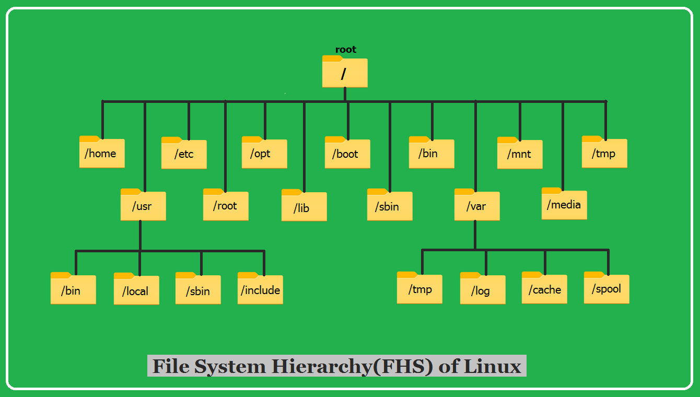
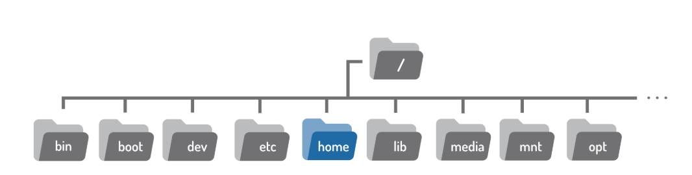
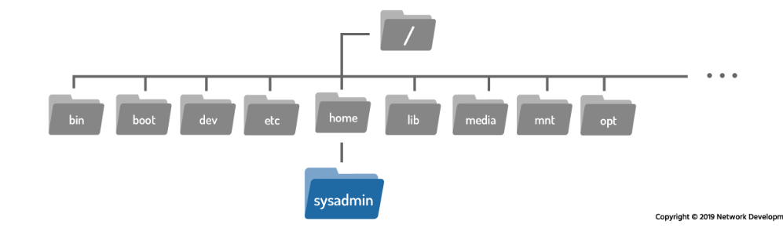
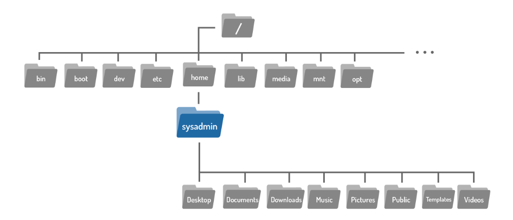
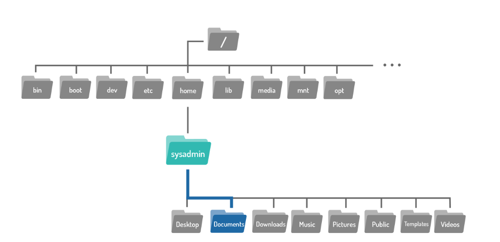
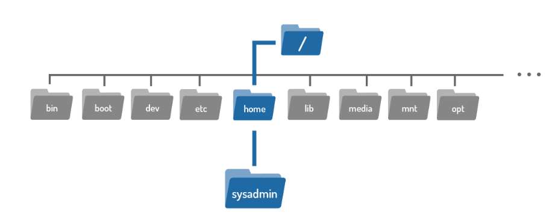
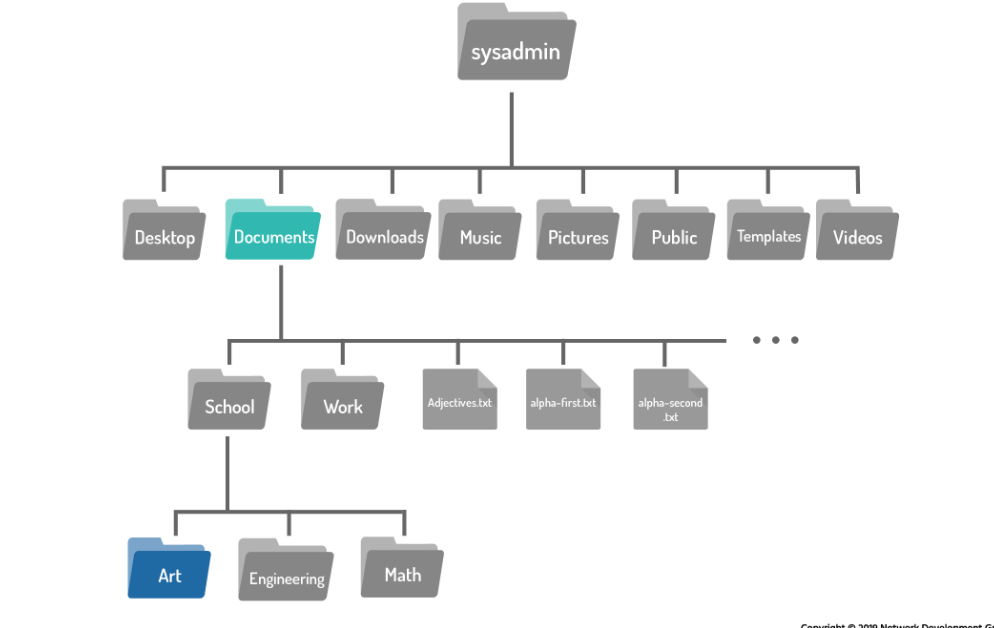
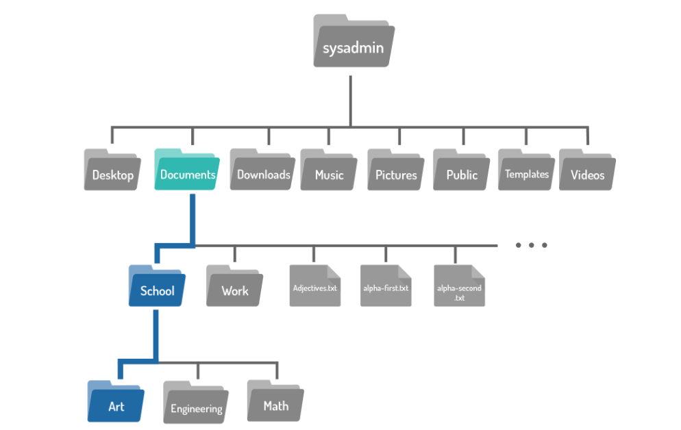
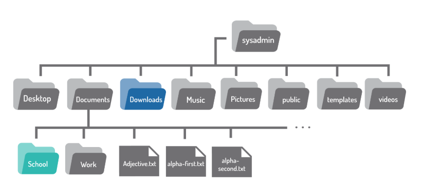

# Day 2 - Linux Basics
## Learning outcomes

By the end of Day 2, students can:

- Explain Linux vs distribution, and kernel vs userland.
- Understand what CLI, terminal, and TTY mean.
- Identify the purpose of key folders: `/`, `/home`, `/etc`, `/var`.
- Use basic navigation and viewing commands: `pwd`, `ls`, `cd`, `cat`, `less`.
- Use built-in help: `man`, `--help`.

---

## 1. Linux vs Distribution

### Linux kernel

Linux is the kernel: the core program that talks to hardware such as CPU, memory, disks, and network devices.

It handles:

- Process scheduling, which means running programs.
- Memory management.
- Device drivers.
- Filesystems.
- Networking.

### Distribution, or distro

A Linux distribution is the Linux kernel plus many tools bundled together, such as:

- System libraries, for example `glibc`.
- Shells, for example `bash` or `zsh`.
- Package managers, for example `apt`, `dnf`, or `pacman`.
- Core utilities, for example `ls`, `cp`, and `grep`.
- Services, for example `systemd`.
- Installers, defaults, and documentation.

Examples of Linux distributions include:

- Ubuntu
- Debian
- Fedora
- Rocky Linux
- Arch
- Kali

### Simple analogy

- Kernel = engine.
- Distro = full car, meaning engine + wheels + dashboard + design choices.

---

## 2. CLI Basics

### CLI vs GUI

- GUI: click-based desktop interface.
- CLI: typed commands in a terminal.

### Why CLI is important in Linux

The CLI is important because:

- Servers often have no GUI.
- CLI commands are useful for automation and scripting.
- Remote management is commonly done through SSH.
- CLI is faster for repetitive tasks.

---

## 3. Navigating the File System

In Linux, everything is considered a file. Files are used to store data such as text, graphics, and programs. Directories are also a type of file used to store other files. Windows and macOS users usually call directories folders.

Directories provide a hierarchical organization structure. This structure may be different depending on the type of system in use.

When working in Linux, it is important to know how to manipulate files and directories. Some Linux distributions provide GUI-based file managers, but it is very useful to know how to perform these operations from the command line.


## 3.1 Directory Structure

On a Windows system, the top level of the directory structure is called **My Computer**. Physical devices, such as hard drives, USB drives, and network drives, appear under **My Computer** and are assigned drive letters such as `C:` or `D:`.

In Linux, the directory structure is usually called a **filesystem**. It also has a top level, but instead of **My Computer**, it is called the **root directory**. The root directory is represented by the slash character:

```bash
/
```

Linux does not use drive letters like Windows. Instead, each physical device is accessible under a directory.

To view the contents of the root directory, use the `ls` command with `/` as the argument:

```bash
ls /
```

Example output:

```text
bin   boot  cdrom  dev  etc  home  lib  lib32  lib64  media  mnt  opt  proc  root  run  sbin  snap  srv  swap.img  sys  tmp  usr  var
```



## 3.1.1 Home Directory

The term **home directory** often confuses new Linux users. On most Linux distributions, there is a directory called `home` under the root `/` directory.



Under `/home`, there is a directory for each user on the system. The directory name is usually the same as the username. For example, a user named `sysadmin` would have a home directory called:

```bash
/home/sysadmin
```



The home directory is important because:

- When a user opens a shell, they are usually placed in their home directory.
- This is where users usually do most of their work.
- The home directory is one of the few directories where the user has full control to create and delete files and directories.
- On most Linux distributions, only the owner and the administrator can access the files in a user's home directory.
- Most other directories in Linux are protected with file permissions.

The home directory has a special shortcut symbol:

```bash
~
```

For example, if the `sysadmin` user is logged in, `~` represents:

```bash
/home/sysadmin
```

It is also possible to refer to another user's home directory by using `~` followed by the username. For example:

```bash
~bob
```

This is equivalent to:

```bash
/home/bob
```

---

## 3.1.2 Current Directory

To determine where the user is currently located in the filesystem, use the `pwd` command.

```bash
pwd [OPTIONS]
```

`pwd` stands for **print working directory**. It prints the current location of the user within the filesystem.



Example:

```bash
pwd
```

Example output:

```text
/home/rohan
```

---

## 3.1.3 Changing Directories

When a user opens a shell, they typically begin in their home directory.


To navigate the filesystem, use the `cd` command.

```bash
cd [options] [path]
```

`cd` stands for **change directory**.



For example, if there is a directory called `Documents` inside the current user's home directory, move into it with:

```bash
cd Documents/
```

When `cd` is used with no arguments, it takes the user back to their home directory.

Example:

```bash
cd Downloads/
cd
```

In many Linux terminals, the prompt displays the current working directory. The tilde `~` represents the user's home directory.

---

## 3.2 Paths

The argument passed to the `cd` command is more than just a directory name. It is a **path**.

A path is a list of directories separated by the `/` character. If you think of the filesystem as a map, paths are directory addresses. They provide step-by-step navigation directions and can be used to indicate the location of any file or directory.



For example:

```bash
/home/sysadmin
```

This is a path to the `sysadmin` user's home directory.

There are two types of paths:

- Absolute paths.
- Relative paths.

---

## 3.2.1 Absolute Paths

An **absolute path** specifies the exact location of a directory or file. It always starts from the root directory `/`, so it always begins with `/`.

Example:

```bash
/home/sysadmin
```

This path tells the system to:

1. Begin at the root directory `/`.
2. Move into the `home` directory.
3. Move into the `sysadmin` directory.

Example command:

```bash
cd /home/sysadmin
```

If the command succeeds, it usually gives no output. You can confirm the current location with:

```bash
pwd
```

Example output:

```text
/home/sysadmin
```

---

## 3.2.2 Relative Paths

A **relative path** starts from the current directory. It gives directions to a file or directory relative to the user's current location.

Relative paths do not start with `/`. Instead, they usually start with the name of a directory contained inside the current directory.

Example:

```bash
cd Documents
```

If the user is currently in the home directory, this moves into the `Documents` directory.

Example prompt after moving:

```text
sysadmin@localhost:~/Documents$
```

If the user is located in the `Documents` directory and wants to move to the `Art` directory inside `Documents/School`, there are multiple ways to do it.



Using the absolute path:

```bash
cd /home/sysadmin/Documents/School/Art
```

Using multiple relative paths:

```bash
cd School
cd Art
```

Using a single relative path:

```bash
cd School/Art
```

To confirm the change:

```bash
pwd
```



Example output:

```text
/home/sysadmin/Documents/School/Art
```

---

## 3.2.3 Shortcuts

### The `..` characters

No matter which directory the user is in, two periods `..` represent one directory higher than the current directory. This is called the **parent directory**.

For example, to move from the `Art` directory back to the `School` directory:

```bash
cd ..
```

The `..` shortcut can also be used in longer paths.



For example, to move from the `School` directory to the `Downloads` directory:

```bash
cd ../Downloads
```

### The `.` character

No matter which directory the user is in, a single period `.` represents the current directory.

For `cd`, this shortcut is not very useful, but it becomes useful with other commands.

---

## 3.3 Listing Files in a Directory

When working in the command line, users do not always have visual maps of the filesystem. Therefore, they must rely on command-line tools. One of the most important commands for filesystem navigation is `ls`.

```bash
ls [OPTION]... [FILE]...
```

The `ls` command displays the contents of a directory. It can also provide detailed information about files.

By default, when used without options or arguments, it lists files in the current directory:

```bash
ls
```

Example output:

```text
Desktop Documents Downloads Music Pictures Public Templates Videos
```

The `ls` command can also list the contents of another directory if a path is given as an argument:

```bash
ls /var
```

Example output:

```text
backups cache lib local lock log mail opt run spool tmp
```

### Useful `ls` variations

```bash
ls
```

Lists files and folders.

```bash
ls -l
```

Shows a long listing with permissions, owner, size, and time.

```bash
ls -a
```

Includes hidden files, which start with `.`.

```bash
ls -la
```

Combines long listing and hidden files.

---

## 3.3.1 Listing Hidden Files

When the `ls` command displays the contents of a directory, not all files are shown automatically. Hidden files are omitted by default.

A hidden file or directory is any file or directory that begins with a dot `.` character.

To display all files, including hidden files, use:

```bash
ls -a
```

Hidden files are usually configuration or customization files. They customize how Linux, the shell, or programs work.

For example, the `.bashrc` file in the home directory customizes shell features such as variables and aliases.

These files are hidden because users do not usually work with them every day. Showing them all the time can make it harder to find regular files.

---

## 3.3.2 Long Display Listing

Each file has details associated with it. These details are called **metadata**. Metadata can include information such as:

- File size.
- Ownership.
- Timestamps.
- Permissions.

To view this information, use the `-l` option with `ls`:

```bash
ls -l
```

Example output:

```text
total 52
drwxrwxr-x 7 rohan rohan 4096 Mar 29 23:20 awscli-local
drwxr-xr-x 3 rohan rohan 4096 Mar 29 21:28 Desktop
drwxr-xr-x 3 rohan rohan 4096 Mar 17 19:08 Documents
drwxr-xr-x 3 rohan rohan 4096 Mar 31 14:49 Downloads
-rw-r--r-- 1 root  root   640 Mar 10 09:59 packages.microsoft.gpg
drwxr-xr-x 2 rohan rohan 4096 Feb 28 13:26 Pictures
drwxr-xr-x 3 rohan rohan 4096 Mar 5 18:52 snap
drwxr-xr-x 2 rohan rohan 4096 Mar 17 22:00 Videos
```

Each line displays metadata about one file or directory.

### File type

The first character of each line indicates the file type.

Example:

```text
-rw-r--r-- 1 root root 15322 Dec 10 21:33 alternatives.log
drwxr-xr-x 1 root root 4096 Jul 19 06:52 apt
```

| Symbol | File type      | Description                                                               |
| ------ | -------------- | ------------------------------------------------------------------------- |
| `d`    | Directory      | A file used to store other files.                                         |
| `-`    | Regular file   | Includes readable files, image files, binary files, and compressed files. |
| `l`    | Symbolic link  | Points to another file.                                                   |
| `s`    | Socket         | Allows communication between processes.                                   |
| `p`    | Pipe           | Allows communication between processes.                                   |
| `b`    | Block file     | Used to communicate with hardware.                                        |
| `c`    | Character file | Used to communicate with hardware.                                        |

In the example above, `alternatives.log` is a regular file because it starts with `-`, while `apt` is a directory because it starts with `d`.

### Permissions

Example:

```text
drwxr-xr-x 2 root root 4096 Jul 19 06:51 journal
```

The next nine characters show the permissions of the file. Permissions indicate how certain users can access a file.

Permissions are usually covered in more detail later in a Linux course.

### Hard link count

Example:

```text
-rw-r----- 1 syslog adm 371 Dec 15 16:38 auth.log
drwxr-xr-x 2 root root 4096 Jul 19 06:51 journal
```

The number after the permissions indicates how many hard links point to the file.

Links are usually covered in more detail later in a Linux course.

### User owner

Example:

```text
-rw-r----- 1 syslog adm 197 Dec 15 16:38 cron.log
```

Every file is owned by a user account. This matters because the owner has rights to set permissions on the file.

### Group owner

Example:

```text
-rw-rw-r-- 1 root utmp 292584 Dec 15 16:38 lastlog
```

This field indicates which group owns the file. Members of that group may have a specific set of permissions on the file.

### File size

Example:

```text
-rw-r----- 1 syslog adm 14185 Dec 15 16:38 syslog
```

This field displays the file size in bytes.

For directories, this value does not describe the total size of the directory. Instead, it shows how many bytes are reserved to track filenames in that directory. In other words, ignore this field for directories.

### Timestamp

Example:

```text
-rw-rw---- 1 root utmp 0 May 26 2018 btmp
```

The timestamp indicates when the file contents were last modified.

For directories, the timestamp indicates the last time a file was added to or deleted from the directory.

### File name

Example:

```text
-rw-r--r-- 1 root root 35330 May 26 2018 bootstrap.log
```

The final field contains the name of the file or directory.

For symbolic links, the link name is displayed with an arrow and the path of the original file.

Example:

```text
lrwxrwxrwx. 1 root root 22 Nov 6 2018 /etc/grub.conf -> ../boot/grub/grub.conf
```

---

## 3.3.3 Recursive Listing

Sometimes you may want to display all files in a directory and all files inside its subdirectories. This is called a **recursive listing**.

To perform a recursive listing, use the `-R` option:

```bash
ls -R /etc/ppp
```

Example output:

```text
/etc/ppp:
ip-down.d ip-up.d

/etc/ppp/ip-down.d:
bind9

/etc/ppp/ip-up.d:
bind9
```

In this example, the files in `/etc/ppp` are listed first. Then the contents of the subdirectories `/etc/ppp/ip-down.d` and `/etc/ppp/ip-up.d` are listed.

---

## 4. Viewing Files: `cat` vs `less`

### `cat` for quick output

Use `cat` for short files.

Example:

```bash
cat /etc/os-release
```

`cat` prints everything at once, so it is best for short files.

### `less` for long files

Use `less` for long files.

Example:

```bash
less /etc/services
```

Inside `less`, useful keys include:

| Key               | Action              |
| ----------------- | ------------------- |
| `q`               | Quit                |
| `/word`           | Search for `word`   |
| `n`               | Go to next match    |
| `Shift + g`       | Go to end of file   |
| `g`               | Go to start of file |
| Arrow keys        | Scroll              |
| PageUp / PageDown | Scroll by page      |

---

## 5. Getting Help: `man` and `--help`

### Man pages

Use `man` to open the manual page for a command.

Example:

```bash
man ls
```

Man pages are navigated like `less`:

- Press `q` to quit.
- Use `/pattern` to search.

### Command help

Many commands also support `--help`.

Example:

```bash
ls --help
```

A useful pattern is:

```bash
man <command>
<command> --help
```

---

## 6. Mini Practice Tasks

Complete these tasks in 5 to 10 minutes.

### Task 1: Go to `/etc` and list files

```bash
cd /etc
ls
```

### Task 2: Show your current folder

```bash
pwd
```

### Task 3: View Linux version information

```bash
cat /etc/os-release
```

### Task 4: Use `less` to open `/etc/services` and search for `ssh`

```bash
less /etc/services
```

Inside `less`, search for `ssh`:

```text
/ssh
```

Press `n` to go to the next match and `q` to quit.

### Task 5: Find help for `cd`

`cd` is a shell built-in, so use:

```bash
help cd
```

You can also try:

```bash
man bash
```

Then search for `cd` inside the Bash manual.

---

## 7. Common Beginner Mistakes

- Forgetting that Linux is case-sensitive, for example `Documents` is not the same as `documents`.
- Running `cd /Home` instead of `cd /home`.
- Using `cat` on very large files instead of `less`.
- Not knowing how to exit `less`; press `q`.

---

## 8. Quick Command Summary

| Command            | Purpose                                |
| ------------------ | -------------------------------------- |
| `pwd`              | Print current working directory.       |
| `ls`               | List files and directories.            |
| `ls -l`            | Show long listing with metadata.       |
| `ls -a`            | Show hidden files.                     |
| `ls -la`           | Show hidden files with long listing.   |
| `ls -R`            | List files recursively.                |
| `cd <path>`        | Change directory.                      |
| `cd`               | Go back to home directory.             |
| `cd ..`            | Move one level up.                     |
| `cat <file>`       | Print file content quickly.            |
| `less <file>`      | View long files page by page.          |
| `man <command>`    | Open command manual.                   |
| `<command> --help` | Show command help.                     |
| `help cd`          | Show help for the `cd` shell built-in. |
|                    |                                        |
|                    |                                        |
